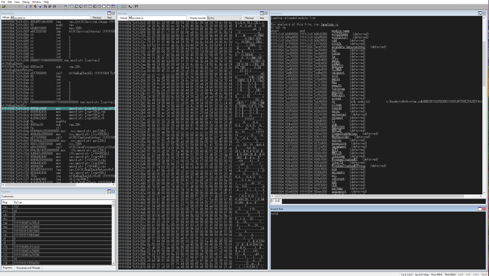

# WinDbg Classic Dark - The most simple Dark Theme of WinDbg



## Setup

- Open Workspace file.

``` bash
# You should change the file path
"C:\Program Files (x86)\Windows Kits\10\Debuggers\x64\windbg.exe" -Q -WF "C:\Users\Public\Downloads\WinDbg-Classic-Dark.WEW"
```

- Or, set as default theme via change "HKEY_CURRENT_USER\SOFTWARE\Microsoft\Windbg\Workspaces\Default"(Use "WinDbg-Classic-Dark.reg").